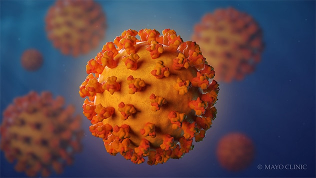
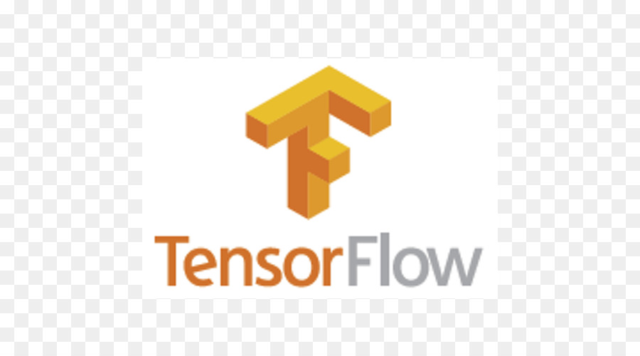
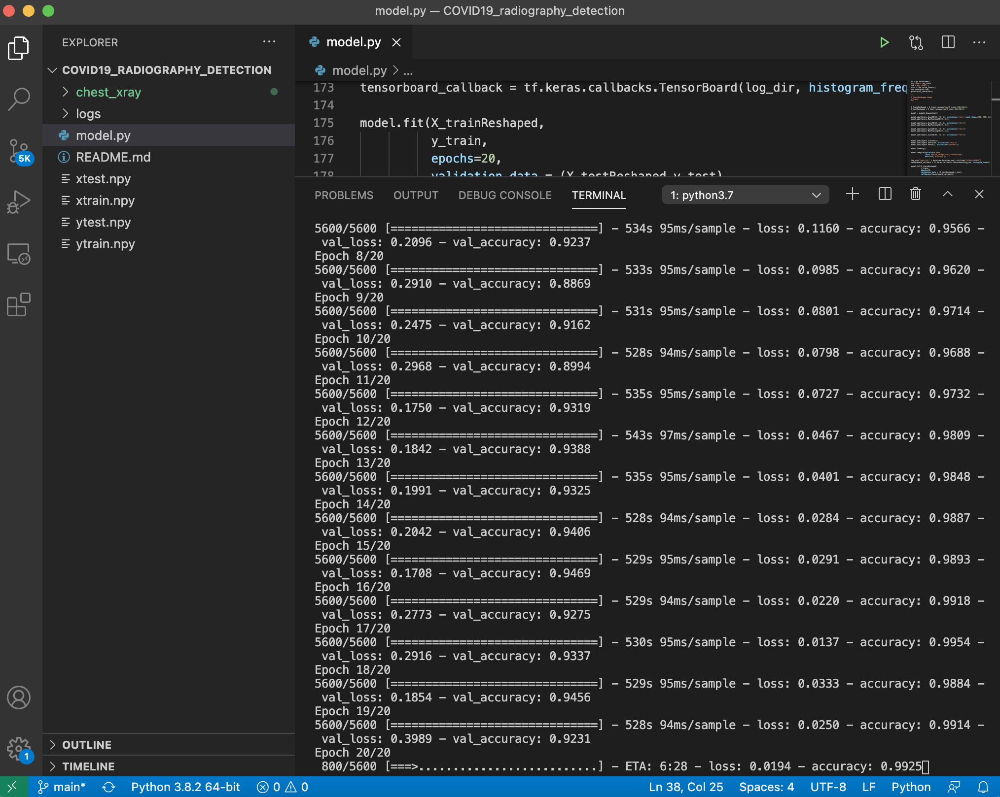
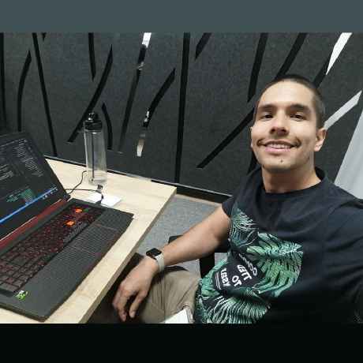

# COVID19_radiography_detection

## **About the Project**
This project attempts to detect through the use of data and image analysis tools in the field of Machine Learning, such as convolutional neural networks or deep neural networks, the detection of COVID-19 SARS COV2 in chest X-ray images.

Through the use of neural networks in the field of Machine Learning, it is expected to have an accuracy greater than 85% in the detection of COVID-19 SARS COV2.

The intention of this project is directed to the medical community to provide additional diagnostics in the detection of COVID-19 SARS COV2.

---
## **Data**

We are going to collect data from Kaggle datasets in order to have radiography for people with COVID-19 positive cases along with Normal or healthy people images.

---

## **Requirements**
||||||
:---:|:---:|:---:|:---:|:---:
|||||
||||

---

## **How many images are required to train a CNN?**
5.000 images may be too few for a Convolutional Neural Network(CNN), in fact, research projects carried out by NVIDIA have trained around 100,000 diagnostic images of OCT (optical coherence tomography), with excellent results.

Currently our model has around 7,200 images that were generated by x-ray radiography.

So as the target data set is large and different from the base data set, we created a training model, which will fit our needs, you can see this model in this [link](model.py).

---

## **Setup Environment**
> To get started on Ubuntu 20.04...
### Step 1
- Install <a href="https://www.anaconda.com/distribution/
">Anaconda </a>
- Open your terminal a type
    ~~~ 
    cd /tmp
    curl https://repo.anaconda.com/archive/Anaconda3-2020.02-Linux-x86_64.sh --output anaconda.sh
    ~~~
- Verify the integrity of the installer's data
    ~~~ 
    sha256sum anaconda.sh
    ~~~
    ***Output***
    ~~~
    2b9f088b2022edb474915d9f69a803d6449d5fdb4c303041f60ac4aefcc208bb  anaconda.sh
    ~~~
- Run Anaconda script
    ~~~
    bash anaconda.sh
    ~~~
    > You will receive the following result to review the license agreement by pressing ENTER until you reach the end.

    ***Output***
    ~~~
    Welcome to Anaconda3 2020.02

    In order to continue the installation process, please review the license
    agreement.
    Please, press ENTER to continue
    >>>  
    ~~~
    _When you reach the end of the license, type yes, if you accept the license, to complete the installation._
    >When the installation is complete, you will receive the following output:
    ~~~
    ...
    installation finished.
    Do you wish the installer to initialize Anaconda3
    by running conda init? [yes|no]
    [no] >>>  
    ~~~
- Activate the installation
    ~~~
    source ~/.bashrc
    ~~~
- Set up Anaconda environments
    >It is good practice to create new environments for each of your projects. To create a Python 3 environment called my_env, the syntax is as follows:
    ~~~
    conda create --name my_env python=3
    ~~~
    >You can activate your new environment by typing the following:
    ~~~
    conda activate my_env
    ~~~
    > When you're ready to disable your Anaconda environment, you can do so by typing the following:
    ~~~
    conda deactivate
    ~~~
### Step 2
- Prepare our anaconda environment by writing the following in the terminal:
    ~~~
    conda activate my_env
    sudo apt-get -y install python3-pip
    """Libraries to install"""
    from __future__ import absolute_import, division, print_function, unicode_literals
    import pandas as pd
    import tensorflow as tf
    from tensorflow.keras import datasets, layers, models
    import matplotlib.pyplot as plt
    import numpy as np
    import os
    from tqdm import tqdm
    import cv2
    from glob import glob
    import sklearn
    import skimage
    from skimage.transform import resize
    import random
    import datetime
    from imblearn.over_sampling import RandomOverSampler
    from imblearn.under_sampling import RandomUnderSampler
    from skimage.color import rgb2gray
    import seaborn as sns
    git clone https://github.com/oscarmrt/COVID19_radiography_detection.git
    cd COVID19_radiography_detection
    mkdir chest_xray
    cd chest_xray
    ~~~

- In the data folder you have to copy the follow images:
[drive images](https://drive.google.com/drive/folders/1jgE1mWYO43CSeArlU9zUlXm994CP9A9Q?usp=sharing) this is our x-ray images we used to train the model

### Step 3
- In this moment you have to be in the data folder so lets go to move to the principal path typing **`cd ..`** after that we have to write the following:
    ~~~
    ./model.py
    ~~~

- If everything is ok you can get a result like this in your terminal

    

---

## **Results**
For Kiwi, the sectors are very important, that's why they shared the areas that they needed to recognize, these areas are shown in the following image:

>The red zone is ***near***, the yellow is ***medium***, the green is ***far*** and where there is no color it is considered ***super far***.

During the development of the MVP and taking into account the areas of proximity given by the company, we obtained the following results

As you can see in these 2 images, the model is able to recognize if a person has their back to the robot and classifies it as super far, while if the person is facing it, it classifies it depending on the area, in this case it is in the middle area.

---

## **Bugs**
At this time the model has 89.87% of accurately predicting the image to evaluate, for this reason there may be an error of around 11% and we want to show some errors that we found during the development of the MVP

In the first photo, the image is in the far zone and the model classifies it as super far, the second photo is a photo that is clearly in the near zone, but the model classifies it in the super far zone. These errors would belong to that 11% probability of being wrong and would lead to readjusting the model.

---

## **Conclusions**
1. The model dataset must be improved, in order to have a different type of information that feeds the model and leaves it better balanced, currently it has 3 people, 2 people and 1 people on a walking street.

2. More time must be dedicated to enter to investigate the weights that the model currently has, in order to punish the error and that the model continues to learn and improve, since its accuracy is currently 89%.

3. During the development of the MVP, it was possible to achieve a simulator using Unity, train a Machine Learning model and deploy using heroku, bootstrap and js.

4. Although the Holberton foundations program did not include the technologies worked on, the Holberton program did teach us how to research and carry out a project from 0 with excellent results.

5. We consider that 5 weeks is too little time to have a model very close to reality, since we worked with simulated images, to improve this it must be put into practice with real images and doing field tests, to improve the development of the model current.

6. Teamwork is vital in this type of work, so knowing how to delegate and empower activities is important, thanks to this we were able to have an MVP according to the requirements of Holberton and Kiwi.

7. Artificial intelligence is a very powerful tool, but you have to know how to use it, for this reason the data you have is very important, since with it you train and if the data is bad, you will have bad results, but if the data is good collected you can have amazing results.

---

## **acknowledgment**
- On behalf of the team, we want to thank Holberton sincerely for the Machine Learning advanced program, for teaching us about soft skills and learning to learn.  

## **Authors**
| | | | | |
:---:|:---:|:---:|:---:|:---:
**Samir Millan**<a></a>|**Oscar Rodriguez**<a></a>|**Diego Quijano**
